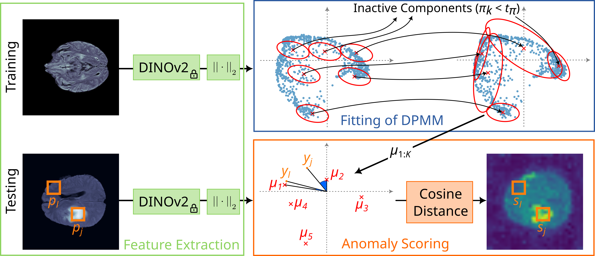

# Anomaly Detection by Clustering DINO Embeddings using a Dirichlet Process Mixture

This is the official code of the paper [Anomaly Detection by Clustering DINO Embeddings using a Dirichlet Process Mixture](https://papers.miccai.org/miccai-2025/paper/2425_paper.pdf), which was presented at MICCAI 2025.

If you use this code, please cite:
```
@InProceedings{Schulthess2025Anomaly,
    author = {Schulthess, Nico and Konukoglu, Ender},
    title = {{Anomaly Detection by Clustering DINO Embeddings using a Dirichlet Process Mixture }},
    booktitle = {MICCAI 2025},
    year = {2025},
}
```

# Method
<div align="center">
  
</div>


# Setup

1. Download [BMAD benchmark datasets](https://github.com/DorisBao/BMAD) and store the datasets either in the folder datasets or create a symbolic link
    ```bash
    ln -s <path/to/dataset> datasets
    ```

2. Create a virtual environment and install all packages. We worked with 
    ```bash
    conda create -n addpmm python=3.12
    conda activate addpmm
    python -m pip install --upgrade pip
    conda env update -f environment.yml
    ```


# Running Inference from a Fitted Dirichlet Process Mixture Model (DPMM)

To run inference with an already fitted DPMM, run
```bash
python main.py --config <path/to/cfg.yaml>
```

## Inference with our checkpoints (coming soon):
We will provide checkpoints with diagonal and full covariance matrices in the DPMM for the BraTS2021, BTCV+LiTs, and RESC datasets from the BMAD benchmark suite.
Our checkpoints will be released soon.
<!-- You can download [our checkpoints](todo) and store them in the folder `results`. -->
If you store our checkpoints in the folder `results`, you can use these commands:
```bash
# BraTS2021 (brain MRI) with diagonal covariance
python main.py --config results/bras2021/dinov2_vits14_dpmm_448_500_diag_pca_-1/cfg.yaml
# BraTS2021 (brain MRI) with full covariance
python main.py --config results/bras2021/dinov2_vits14_dpmm_448_500_full_pca_-1/cfg.yaml


# BTCV+LiTs (liver CT) with diagonal covariance
python main.py --config results/liver/dinov2_vits14_dpmm_448_500_full_pca_-1/cfg.yaml
# BTCV+LiTs (liver CT) with full covariance
python main.py --config results/liver/dinov2_vits14_dpmm_448_500_full_pca_-1/cfg.yaml


# RESC (retinal OCT) with diagonal covariance
python main.py --config results/RESC/dinov2_vits14_dpmm_448_500_full_pca_-1/cfg.yaml
# RESC (retinal OCT) with full covariance
python main.py --config results/RESC/dinov2_vits14_dpmm_448_500_full_pca_-1/cfg.yaml
```

# Fitting a Dirichlet Process Mixture Model (DPMM)
To fit a DPMM from scratch, adjust one of the experiment configurations in the folder `config`. We provide configurations in the folder `config` for the same setup as the checkpoints above. You can run the fitting with
```bash
python main.py --config config/<your_config>.yaml
```

This runs the training followed by evaluating on the test set. Furthermore, anomaly maps and component assignment maps are generated and saved for the validation set using the final model.

# License

This repository is based on [AnomalyDINO](https://github.com/dammsi/AnomalyDINO/), used under the Apache 2.0 License.
This project is under the CC-BY-NC 4.0 license. See [LICENSE](LICENSE) for details.